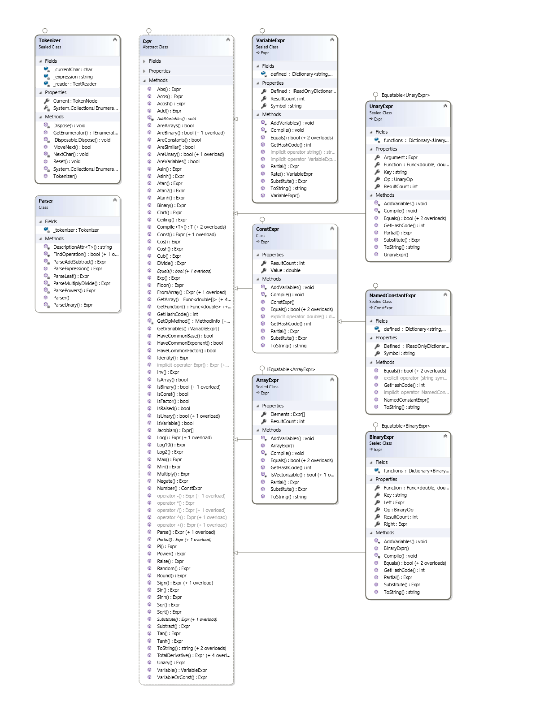

# JA.Parsing

An expression parser for `C#` with easy compilation into delegate functions for fast evaluations, some ability for simplifications and automatic differentialtion. Inspired by [https://github.com/toptensoftware/SimpleExpressionEngine](https://github.com/toptensoftware/SimpleExpressionEngine).

## Code Examples

```C#
    VariableExpr x = "x", y="y";

    var f_input = "(x^2-1)/(x^2+1)";
    Console.WriteLine($"input={f_input}");
    var f = Expr.Parse(f_input);
    Console.WriteLine($"f={f}");
    Console.WriteLine($"f(0.5)={f.Eval(("x", 0.5))}");

    var df = f.Partial(x);
    Console.WriteLine($"df={df}");

    var fp = f.TotalDerivative();
    Console.WriteLine($"fp={fp}");

    var w_input = "x^2 + 2*x*y + x/y";
    var w = Expr.Parse(w_input);
    Console.WriteLine($"w={w}");
    var wx = w.Partial(x);
    Console.WriteLine($"wx={wx}");
    var wy = w.Partial(y);
    Console.WriteLine($"wy={wy}");
    var wp = w.Derivative(x, y);
    Console.WriteLine($"wp={wp}");
```

## Highlights

The main type is `Expr` that holds expression trees. An auxilary type is `VariableExpr` which holds variables. A string input is parsed using `Expr.Parse()` and a variable is declared using implicit conversion `Expr x = "x";` or by calling `Expr x = Expr.Variable("x");`.

An expression can either be build by parsing a string such as `1/ln(x+1)` or by using the static functions defined under `Expr`, such as `Expr.Inv(1/Expr.Log(x))`

Several build-in constants are defined similarly to variables. They are accessible with the following function call `Expr.Const("pi")` or by a property `Expr.Pi`.

Each expression has a `.Substiute(symbol,expression)`  function that can perform variable substitutions. Numerical evaluation is done via compilation into `Func<double,double>`  via the  `.Compile<T>( <list of symbols> )` functions. Shortcuts to`.Compile<T>()` are the `GetFunction()` and `GetArray()` findexer`f[]`.

## Calculus

Besides standard trig functions such as `Expr.Sin(x)` each `Expr` can evaluate both the partial derivative with respect to a variable with `f.Partial(x)` or the total derivative with `f.TotalDerivative()`.

The ****total derivative**** needs the derivative of each variable (rate) which is automatically defined by appending the character `p`  to the name of the variable. Then it performs the chain rule, such as

```C#
fp = f.Partial(x)*xp + f.Partial(y)*yp + ...
```

You can define the names of variable rates by either a list of `varaible-rate` tuples, or 2nd argument with an array of rates. The rates can be just variables names, or can be any expression. For example, if the rate of time is `1` then you can write

```
var q = new VariableExpr[] { "t", "x", "y" }
var qp = new Expr[] { 1, "xp", "yp" }
fp = f.TotalDerivative(q, qp);
```

Each variable has `.Rate()` function that declares a new variables denoting the time derivative of the variable. This is done by appending a `p` character after the main symbol and before any underscores  `_` in the name. For example `"x".Rate()` => `"xp"`  and `"x_1".Rate()`=>`"xp_1"`

## Lightweight Code Generation

Each expression can be converted into a function for extremely fast evaluation of the expressions. The result might be a scalar `double` value for simple expressions, or an array `double[]` for vector expressions. The user must choose the correct result type and number of arguments by selecting the appropriate `GetFunction()` or `GetArray()` function overload.

Each expression is going to emit IL code via `generator.Emit(OpCodes)`  calls and all functions are inlined for very fast evaluations. 

### Simple Function Example

```cs
Expr x = "x";
Expr expr = 0.5 + 0.5*Expr.Sin(x/2);
var f = expr.GetFunction("x");
double y = f(Math.PI); // y = 1.0

```

The equivalent IL code to the function evaluation looks something like this

```cil
ldarg.0        // load 1st argument
ldc_R8.(2)     // load value 2
div            // divide values
call Math.Sin()  // call sine function
ldc_R8.(0.5)   // load 0.5
mul            // multiply values
ldc_R8.(0.5)   // load 0.5
add            // add values
ret            // return result
```

As you can see each node in the expression tree only contributes a minimal amount of IL code and the overall compiled function produces optimized calculations.

### Multivariate Example

```cs
Expr x = "x", y = "y";
Expr expr = "exp(-(x^2)-(y^2))";
var f = expr.GetFunction("x","y");
double z = f(0.2, 0.4); // z = Exp(-0.2)

```

The indexer function `f[]` can be used in place of `GetFunction()` also. For example

```cs
var f = expr["x","y"];
double z = f(0.2, 0.4);
```

## Arrays of Expressions

Arrays are declared as comma separated values beween square brackers, such as `[x,2*x,1/x]` or with the function `Expr.FromArray()`. There is also an implicit conversion between `Expr[]` and an array expression.

All operators and functions auto-convert to vector functions when defined. For example `2*[x,y] = [2*x,2*y]` , `1+[2*x,2] = [2*x+1,3]` and even for unequal length arrays, the smaller array is copied over until it matches the size of the larger array. An example of this is `[x,y]+[1,2,3,4,5] = [x+1,y+2,x+3,y+4,x+5]`

Evaluation functions need the `GetArray(<list-of-symbols>)` function to return the proper delegate type that returns an array `double[]`

### Array Function Example

```cs
Expr expr = "[1,x,sqr(x),cub(x)]";
var f = expr.GetArray("x");
double[] v = f(0.3);
// v[0] = 1.0
// v[1] = 0.09
// v[2] = 0.027
```

## More Details

A list of functions already defined are shown below, but there migth be a few missing

### Named Constants

| `Expr` function | String syntax | Description & Value |
| - | - | :- |
| `Zero` | `"0"` | The value zero  |
| `One` | `"1"` | The value one  |
| `Inf` | `"inf"` | Infinity $\infty$  |
| `Nan` | `"nan"` | Not A Number (IEEE 754 constant) |
| `PI` | `"pi"` | The number $\pi$ |
| `π` | `"π"` | Also the number $\pi$ |
| `DivPI` | `"divpi"` | The number $1/\pi$ |
| `E` | `"e"` | The natural log base $\mathrm{e}$ |
| `Φ` | `"Φ"` | The golden ratio $(1+\sqrt{5})/2$ |
| `Deg` | `"deg"` | Degree to radian conversion factor $\pi/180$ |
| `Rad` | `"rad"` | Radian to degree conversion factor $180/\pi$ |
| `Rpm` | `"rpm"` | Revolutions per minute to radians per second conversion $2\pi/60$ |

### Unary Functions

| `Expr` function | String syntax | Description |
| - | - | :- |
| `Identity(x)` | `"+"` | Does nothing  |
| `Negate(x)` | `"-"` | Negative  |
| `Inverse(x)` | `"inv(x)"` | Inverse `1/x` |
| `Rnd(x)` | `"rnd(x)"` | Random number between `0` and `x` |
| `Pi(x)` | `"pi(x)"` | Value of _π_ multiplied by `x` |
| `Abs(x)` | `"abs(x)"` | Absolute value of `x` |
| `Sign(x)` | `"sign(x)"` | Either `-1` or `+1` depending on sign of `x` |
| `Exp(x)` | `"exp(x)"` | Exponatiation $e^x$ |
| `Log(x)` | `"ln(x)"` | Natural Logarithm  $\ln(x)$ |
| `Log2(x)` | `"log2(x)"` | Logarithm Base 2 $\ln(x)/\ln(2)$ |
| `Log10(x)` | `"log10(x)"` | Logarithm Base 10 $\ln(x)/\ln(10)$ |
| `Sqr(x)` | `"sqr(x)"` | Square $x^2$, opposite of `"sqrt(x)"` |
| `Sqrt(x)` | `"sqrt(x)"` | Square root $\sqrt{x}$, opposite of `"sqr(x)"` |
| `Cub(x)` | `"cub(x)"` | Cube $x^4$, opposite of `"cbrt(x)"` |
| `Cbrt(x)` | `"cbrt(x)"` | Cube root $\sqrt{x}$, opposite of `"cub(x)"` |
| `Floor(x)` | `"floor(x)"` | Floor function (biggest integer <= `x`) |
| `Ceiling(x)` | `"ceil(x)"` | Ceiling function (smallest integer >= `x`) |
| `Round(x)` | `"round(x)"` | Rounding function to nearest integer | 
| `Sin(x)` | `"sin(x)"` | Sine function (argument in radians) |
| `Cos(x)` | `"cos(x)"` | Cosine function (argument in radians) |
| `Tan(x)` | `"tan(x)"` | Tangent function (argument in radians) |
| `Sinh(x)` | `"sinh(x)"` | Sine hyperbolic function |
| `Cosh(x)` | `"cosh(x)"` | Cosine hyperbolic function |
| `Tanh(x)` | `"tanh(x)"` | Tangent hyperbolic function |
| `Asin(x)` | `"asin(x)"` | Arc-sine function (result in radians) |
| `Acos(x)` | `"acos(x)"` | Arc-cosine function (result in radians) |
| `Atan(x)` | `"atan(x)"` | Arc-tangent function (result in radians) |
| `Asinh(x)` | `"asinh(x)"` | Arc-Sine hyperbolic function |
| `Acosh(x)` | `"acosh(x)"` | Arc-Cosine hyperbolic function |
| `Atanh(x)` | `"atanh(x)"` | Arc-Tangent hyperbolic function |


### Binary Functions


| `Expr` function | String syntax | Description |
| - | - | :- |
| `Add(x,y)` | `"+"`  | Addition  |
| `Substract(x,y)` | `"-"`  | Subtraction  |
| `Multiply(x,y)` | `"*"` | Multiplication |
| `Divide(x,y)` | `"/"` | Division |
| `Max(x,y)` | `"max(x,y)"` | Maximum value |
| `Min(x,y)` | `"min(x,y)"` | Minimum value |
| `Sign(x,y)` | `"sign(x,y)` | `abs(x)*sign(y)` |
| `Log(x,y)` | `"log(x,y)"` | Logarith of `x` with base `y` |
| `Atan2(dy,dx)` | `"atan2(dy,dx)"` | Full quadrant arc tangent function |


### A class diagram is added below


